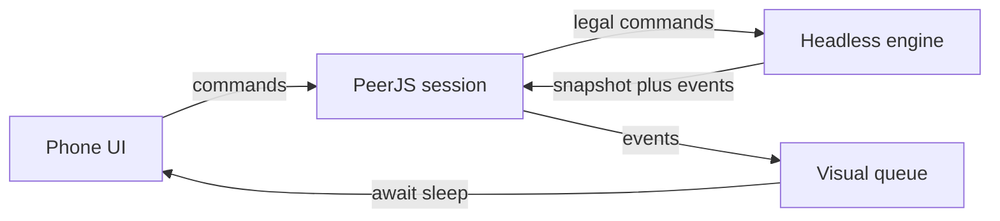

# Seattle Deckbuilder

A two-player deckbuilder for phone browsers. The structure follows Star Realms: authority instead of life, trade to buy, combat to fight, a five-card trade row, bases, outposts, factions, ally abilities, and scrap. The cards themselves are original and live in one file.

Play it on a phone at [https://homekhomek.github.io/SeattleDeckbuilder/](https://homekhomek.github.io/SeattleDeckbuilder/) after Pages is enabled. Two phones can host and join. One phone can pass back and forth.

## Run locally

Node.js 22 or newer.

```bash
npm install
npm run dev
```

Open [http://localhost:5173/SeattleDeckbuilder/](http://localhost:5173/SeattleDeckbuilder/) and use a narrow viewport. The board is 390×740 and scales to the screen.

```bash
npm run sim
npm run build
npm run preview
```

`npm run sim` plays a full game in Node with no browser. The preview is at [http://localhost:4173/SeattleDeckbuilder/](http://localhost:4173/SeattleDeckbuilder/). `vite.config.js` sets `base` to `/SeattleDeckbuilder/`.

## Architecture

Keep this split. Future changes should follow it.

- `src/cards.js` is the only card catalog. Adding a card means adding a data object there, not a new component and not a new rule function.
- `src/game/engine.js` is the only place that changes a match. `applyCommand(state, command)` returns `{ state, events, error }`. It does not import React, CSS, or PeerJS. Illegal commands return the previous state.
- React never imports the engine. Screens send command objects through `src/net/session.js`. The session is the only door into the rules.
- The engine emits visual events. `src/visual/queue.js` plays that list in order with `await sleep(ms)`. Components render the latest state snapshot and use the queue for the banner and motion. `Card` takes `flip` for a 3D turn that shows the card back. The queue sets it when a card is drawn or fills the trade row. Discarded and bought cards fly to the center and shrink for that wait. Row slots slide when their position changes. Do not encode rules in click handlers, and do not start timers inside the engine.
- Layout is absolute divs in `src/index.css` on a 390×740 board. The board scales to the phone. Controls are tap targets, not hover.
- Every card on screen is `src/components/Card.jsx`. The catalog, trade row, hand, bases, and choice tray all use it.



### Commands

`PLAY_CARD`, `PLAY_HAND`, `SCRAP_CARD`, `BUY_CARD`, `ATTACK_PLAYER`, `ATTACK_BASE`, `CHOOSE`, `END_TURN`.

`PLAY_HAND` plays the hand from the left until it is empty, a choice opens, or the game ends. Cards are also draggable: drag up from a card and drop it on the pad. A sideways swipe still scrolls the row. Tap still plays or scraps. Buying requires a drag onto the buy pad, which sits low on the board.

Choices from hand, discard, or the trade row all use `src/components/CardPicker.jsx`. Each option is `{ id, zone }`, and the picker always groups them in the same order: Hand, Discard, Trade row, In play, Bases.

Trade, combat, and authority use symbols from [game-icons.net](https://game-icons.net) (CC BY 3.0): coins, crossed swords, and healing. Factions use anchor, shop, subway, and anvil. Ally abilities use that card's faction symbol, and scrap abilities use a trash can. Credit Lorc and Delapouite on the home screen.

View all cards has − and + controls for how many copies of each trade card go in the deck (0 to 8). Those counts are saved on the phone. The host’s counts, or the pass-and-play phone’s counts, are what `setupGame` uses.

Only the player who must act may send one. A pending choice blocks every command except `CHOOSE`. Outposts must be destroyed before the player or their other bases can be hit. Combat is spent on the opponent as soon as they have no bases left. Unspent trade, and any combat still left at end of turn, is lost. Ships in play and cards left in hand are discarded, then that player draws five. Bases stay. Ally abilities arm again at the start of that player’s next turn. A player at 0 authority loses.

Effects on a card are data: `gainTrade`, `gainCombat`, `gainAuthority`, `draw`, `opponentDiscard`, `scrapFromHandOrDiscard`, `scrapFromTradeRow`. Triggers are `play`, `ally`, and `scrap`. A choice pauses the rest of the effect list on `pendingChoice.resume` until `CHOOSE` resolves.

### Hidden information

The host holds the full state, including deck order. `viewFor` is what a phone receives. Decks are counts. The opponent’s hand is a count. Discard piles, the trade row, bases, and played ships are visible. `pendingChoice.resume` is never sent. Draw events for the other player do not include the card id.

Pass-and-play uses the same engine on one phone and shows whoever must act, so the hand flips when the phone should be passed.

### PeerJS

`createHost` opens a short code. `createGuest(code)` connects. Guests send `{ t: 'command', command }`. The host applies it and sends `{ t: 'sync', view, events }` back, with a different view and event list for each seat. The public PeerJS broker has to be reachable. GitHub Pages is HTTPS, which phones need for WebRTC.

### Screens

Home has Host, Join, Pass and play, and View all cards. View all cards lists `src/cards.js` through the shared card component.

### Adding a card

Add one object to the `cards` array. Set `supply` to `trade`, `starter`, or `explorer`. Trade cards need `deckCopies`, which is the default the copy controls start from. Starters need `opening`. Use the effect vocabulary above. If a new effect kind is required, teach `applyEffectList` in the engine and `linesFor` in `src/cards.js`, then update this section.

## Deploy

Pushes to `main` run [`.github/workflows/pages.yml`](.github/workflows/pages.yml). The workflow installs dependencies, runs `npm run build`, uploads `dist/`, and deploys with the official Pages actions.

### One-time setup

In the repository on GitHub, open **Settings > Pages** and set **Source** to **GitHub Actions** if it is not already.
